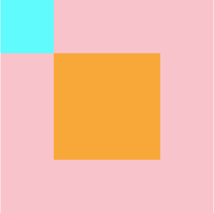

# CSS Layout Practice

### layout with margin

margin 속성을 사용해서 엘리먼트를 수평 가운데 정렬시킬 수 있습니다.

```css
div {
  margin: 0 auto;
}
```

[Codepen으로 직접 해보기](https://codepen.io/vanillacoding/pen/ZEabLRO?editors=1100)

### position (1)

*   `position: static`

    따로 position을 설정하지 않았을 때의 기본값
*   `position: relative`

    주변의 다른 엘리먼트들과의 상대적인 위치를 설정할 수 있게 됩니다.

```css
.class {
  position: relative;
}
```

.png>)

[Codepen으로 직접 해보기](https://codepen.io/vanillacoding/pen/ExbVZpX?editors=1100)

### position (2)

*   `position: absolute`

    주변의 엘리먼트는 무시하고, position이 relative로 설정되어 있는 가장 가까운 상위 엘리먼트만을 기준으로 위치를 설정할 수 있게 됩니다.

```css
.class {
  position: absolute;
}
```



[Codepen으로 직접 해보기](https://codepen.io/vanillacoding/pen/VwrvPBd?editors=1100)

### layout - flex

flex는 크게 두가지 요소로 구성됩니다.

* `flex container`: flex box 들을 감싸는 요소입니다.
* `flex item`: 유연(flexible)하게 늘어나거나 줄어들며 레이아웃을 구성하는 요소들 입니다.

```css
.flex-container {
  display: flex;
}

.flex-box {
  flex: 1;
}
```


[Codepen으로 직접 해보기](https://codepen.io/vanillacoding/pen/WNXQRgN?editors=1100)

### layout - flex (2)

flex-direction 속성을 통해 flex item들이 정렬될 방향(축)을 바꿀 수 있습니다.

```css
.flex-container {
  display: flex;
  flex-direction: column;
}
```


[Codepen으로 직접 해보기](https://codepen.io/vanillacoding/pen/QWOjdZw?editors=1100)

### layout - flex (3)

flex container의 `justify-content`와 `align-items` 속성을 통해 flex item들을 정렬시킬 수 있습니다.

```css
.flex-container {
  display: flex;
  justify-content: center;
  align-items: center;
}
```


[Codepen으로 직접 해보기](https://codepen.io/vanillacoding/pen/YzEyNJj?editors=1100)
