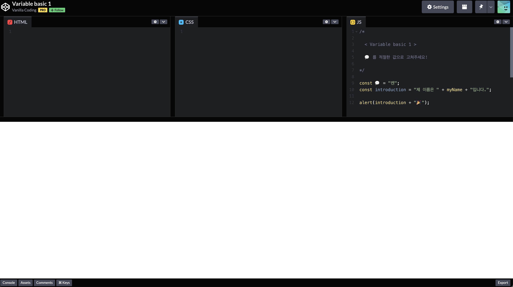
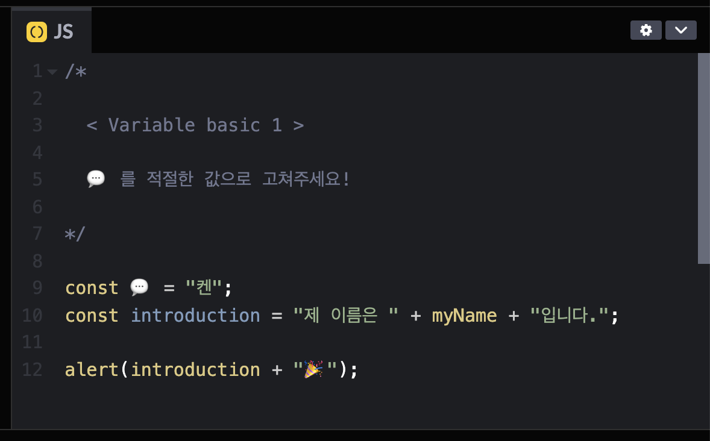
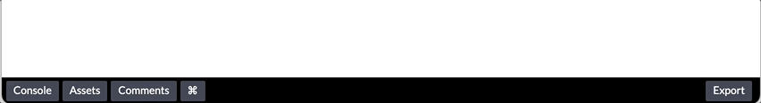

# 🖋  How to Solve Practice

사전학습가이드에는 각 주제 별 Practice가 준비되어있습니다. \
모든 Quiz는 온라인 에디터인 Codepen을 통해 직접 풀어볼 수 있는데요. \
각 주제마다 준비된 [<mark style="color:blue;">Codepen에서 직접 해보기</mark>](https://codepen.io/vanillacoding/pen/a652ff79df8b783236cdbe25e40eee29) 라는 링크를 통해 확인하실 수 있습니다. \
그럼 이제 퀴즈를 푸는 방법을 하나 하나 설명드리도록 하겠습니다.

### Quiz #1

```javascript
/*

  < Variable basic 1 >

  💬 를 적절한 값으로 고쳐주세요!

*/

const 💬 = "켄";
const introduction = "제 이름은 " + myName + "입니다.";

alert(introduction + "🎉");
```

[Codepen에서 직접 해보기](https://codepen.io/vanillacoding/pen/a652ff79df8b783236cdbe25e40eee29)


Codepen에는 HTML, CSS, JS 코드를 작성할 수 있는 탭들이 있고, \
여러분은 JS 탭을 확인해주시면 됩니다.





JS 탭의 내용은 크게 아래 2가지로 구성되어 있습니다.

1. **문제에 대한 설명 (/\* \*/ 내부의 글자)**
2. **문제와 관련된 코드 내용**

여러분의 목표는 코드에 있는 말풍선 (💬) 을 지우고 해당 부분에 적절한 코드를 입력하여 \
폭죽(🎉)이 나오도록 해주시는 것입니다.




현재 문제에서는 `myName`이 없어 `introduction`이 완성되지 못하고 있네요!

\
Codepen에서는 여러분이 코드를 수정할 때 마다 자동으로 코드를 실행시킵니다.\
또한 코드 실행이 완료된다면 화면 오른쪽 아래에 ✅ 표시와 함께 완료를 알려주는 메세지가 나타납니다.




만약, 문제를 해결하지 못하셨다면 폭죽은 터지지 않겠죠?

다시 예제로 돌아와 말풍선 대신에 `myName`을 직접 작성하여 완성시켜 주면 잠시 뒤 \
`"제 이름은 켄입니다. 🎉"` 라는 성공 알림창이 나타나게 됩니다.


