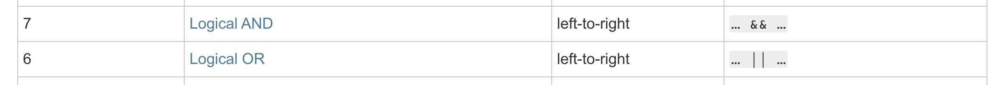

# Logical Operators

### Logical NOT Operator

* `!`를 이용해 표현합니다.
* `!` 뒤에 오는 값을 `true`(Boolean)으로 변환할 수 있다면 `false`를 반환하고, 그렇지 않을 경우 `true`를 반환합니다.

```javascript
!true;                 // false
!2;                    // false
!"abc";                // false
!(function foo () {})  // false
!{ name: 'ken' }       // false

!false;                // true
!"";                   // true
!0;                    // true
```

#### Truthy and Falsy

이전 단계에서 배웠다시피, 자바스크립트의 모든 값들은 **자료형에 따라 7가지로** 나눌 수 있습니다.

자료형과 더불어 자바스크립트의 값들을 나누는 또 다른 기준이 한 가지 더 있습니다. 그것이 **바로 Truthiness와 Falsiness입니다.** 한국말로 해석하자면, "진실같은 성격"(Truthiness)와 "거짓같은 성격"(Falsiness)입니다. 자바스크립트의 모든 값들은 둘 중 한 가지에 속합니다.

아래에 나열된 값들은 모두 Falsy입니다. 즉, `false`로 변환되는 값입니다.




```javascript
0
-0
false
undefined
null
""
''
``
NaN
```



**위에 나열되지 않은 값들은 모두 Truthy입니다.** 즉, `true`로 변환되는 값입니다.






```javascript
Boolean([ 1, 2, 3 ]);         // true? false?
Boolean([]);                  // true? false?
Boolean({ name: 'hello' });   // true? false?
Boolean({});                  // true? false?
Boolean('abc');               // true? false?
Boolean('  ');                // true? false?
Boolean('   '.trim());        // true? false?
Boolean(300);                 // true? false?
Boolean(-10);                 // true? false?
Boolean(function foo () {});  // true? false?
```

위의 실행문들의 결과를 추측해보시고, 확인해보시기 바랍니다.



### Logical OR Operator

* `||`로 표현합니다.
* `true`나 `false`값이 아닌, 피연산자(operand) 값이 반환됩니다.

#### 연산 방식

1. 연산자를 기준으로 왼쪽부터 Truthy 값을 찾습니다.
2. Truthy 값을 찾은 경우, 연산을 중지하고 해당 값을 반환합니다.
3. 마지막까지 Truthy 값을 찾지 못한 경우, 마지막에 위치한 값을 반환합니다.



```javascript
true || true;                   // ?
true || false;                  // ?
false || true;                  // ?
false || false;                 // ?
"hello" || {};                  // ?
[] || "hello";                  // ?
(function foo () {}) || "hello";  // ?
false || "";                    // ?
```

위의 실행문들의 결과를 추측해보시고, 확인해보시기 바랍니다.



### Logical AND Operator

* `&&`로 표현합니다.
* `true`나 `false`값이 아닌, 피연산자(operand) 값이 반환됩니다.

#### 연산 방식

1. 연산자를 기준으로 왼쪽부터 Falsy 값을 찾습니다.
2. Falsy 값을 찾은 경우, 연산을 중지하고 해당 값을 반환합니다.
3. 마지막까지 Falsy 값을 찾지 못한 경우, 마지막에 위치한 값을 반환합니다.



```javascript
true && true;                  // ?
true && false;                 // ?
false && true;                 // ?
false && false;                // ?
"hello" && {};                 // ?
[] && "hello";                 // ?
"" && "hello";                 // ?
(function foo () {}) && "hello"; // ?
false && "";                   // ?
```

위의 실행문들의 결과를 추측해보시고, 확인해보시기 바랍니다.



### Operator Precedence


AND 연산자의 우선순위가 OR 연산자의 우선순위보다 높습니다.






### 추가 학습 자료

* [Logical Operators - Javascript Info](https://javascript.info/logical-operators)
* \[논리 연산자 - MDN]\([https://developer.mozilla.org/ko/docs/Web/JavaScript/Reference/Operators/%EB%85%BC%EB%A6%AC\_%EC%97%B0%EC%82%B0%EC%9E%90(Logical\_Operators](https://developer.mozilla.org/ko/docs/Web/JavaScript/Reference/Operators/%EB%85%BC%EB%A6%AC\_%EC%97%B0%EC%82%B0%EC%9E%90\(Logical\_Operators)))
