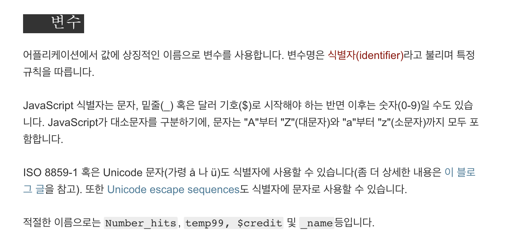

# Object

객체라고 하는 것은 key/value pair를 저장할 수 있는 구조입니다.

key/value가 무엇일까요? 어떤 사람의 프로필을 작성한다고 생각해봅시다. 아래와 같이 작성할 수 있습니다.

< 사람 1 >

* 이름: Ken Huh
* 나이: 13
* 주소: 서울특별시 강남구 삼성로 86길 20

위에서 "이름", "나이", "주소"를 key라고 할 수 있고, 그에 해당하는 각 정보를 value라고 부를 수 있습니다.

> key: "이름", "나이", "주소" value: "Ken Huh", 13, "서울특별시 강남구 삼성로 86길 20"

위 정보를 자바스크립트 객체로 표현해보자면 아래와 같이 할 수 있습니다.

```javascript
var person1 = {
  name: "Ken Huh",
  age: 13,
  address: "서울특별시 강남구 삼성로 86길 20"
};
```

자바스크립트에서 객체는 중괄호 표기를 이용하여 만들 수 있고, 각각의 key/value에 대한 정보를 위와 같이 나열할 수 있습니다. 한 쌍의 key/value 뒤에 "쉼표"를 이용하여 그 뒤에 오는 key/value와 구분해주어야 합니다.

### 객체에 저장된 내용 가져오기

객체에 저장된 정보는 아래와 같이 접근하여 가져올 수 있습니다.

```javascript
var person1 = {
  name: "Ken Huh",
  age: 13,
  address: "서울특별시 강남구 삼성로 86길 20"
};

var myName = person1.name;
var myAge = person1.age;

console.log(myName); // "Ken Huh"
console.log(myAge); // 13
```

아래와 같이도 할 수 있습니다.

```javascript
var person1 = {
  name: "Ken Huh",
  age: 13,
  address: "서울특별시 강남구 삼성로 86길 20"
};

var myName = person1["name"];
var myAge = person1["age"];

console.log(myName); // "Ken Huh"
console.log(myAge); // 13
```



```javascript
const person = {
  name: 'Ken Huh',                       // 속성 이름 - 'name', 속성 값 - 'Ken Huh'
  age: 36,                               // 속성 이름 - 'age', 속성 값 - 36
  'languages': [ 'Korean', 'English' ],  // 속성 이름 - 'languages', 속성 값 - 배열
  '한국 나이': 36                          // 속성 이름 - '한국 나이', 속성 값 - 36
};
```

위에서 `person` 변수에 할당된 객체에는 4개의 속성(Key)가 저장되었습니다.

`'languages'`와 `'한국 나이'`와 같이 속성 이름 부분에 문자열을 써도 상관없습니다만, `'한국 나이'`에 들어간 공백과 같이 **식별자에 허용되지 않는 문자가 들어간 속성 이름**을 정의할 때는 **반드시 문자열 표기(따옴표)를 사용**해야 합니다.

**따옴표가 굳이 필요하지 않은 경우(`name`, `age`, `languages`)에는 일반적으로 따옴표를 사용하지 않습니다.**



#### 식별자 (Identifier)



### 객체에 새로운 key/value 추가하기

```javascript
var person = {
  name: "Ken Huh"
};

console.log(person.name); // "Ken Huh"
console.log(person.age); // undefined (존재하지 않는 key/value)

// 추가
person.age = 13; // 혹은 person["age"] = 13;

console.log(person.age); // 13
```

### 객체 key/value 수정하기

```javascript
var person = {
  name: "Ken Huh",
  age: 13
};

console.log(person.name); // "Ken Huh"
console.log(person.age); // 13

// 수정
person.age = 15; // 혹은 person["age"] = 15;

console.log(person.age); // 15
```

### 객체 key/value 삭제하기

```javascript
var person = {
  name: "Ken Huh",
  age: 13
};

console.log(person.name); // "Ken Huh"
console.log(person.age); // 13

// 삭제
delete person.age;

console.log(person.age); // undefined (더 이상 존재하지 않는 key/value)
```

### 객체 순회하기

주로 객체의 Key/Value를 순회하기 위한 목적으로 사용됩니다.

```javascript
const sample = {
  one: 1,
  two: 2,
  three: 3
};

for (let prop in sample) {
  console.log(prop);
  console.log(sample[prop]);
}
```

* `prop` 변수에 `in` 연산자 뒤에 위치한 객체의 속성들이 하나씩 담깁니다.
  * 예를 들어, 첫 반복 때는 `prop` 변수의 값은 `"one"`, 두번째 반복 시에는 `"two"`, 세번째 반복 시에는 `"three"` 등입니다.
* 객체의 속성은 대괄호를 이용하여 접근할 수 있기 때문에, `sample[prop]`을 이용하여 해당 키값의 Value를 사용할 수도 있습니다.


객체의 Key/Value는 순서를 정의할 수 없습니다. 그래서 **for In loop의 순서는 임의로 정해집니다.** 즉, for in loop 내부에 작성한 여러분의 로직이 Key/Value의 순서에 의존한다면 그 코드는 불안정하다는 의미입니다.\
\
참고링크: [MDN](https://developer.mozilla.org/ko/docs/Web/JavaScript/Reference/Statements/for...in)




```javascript
const me = 'Ken Huh';

function getAge () {
  return 36;
}

const person = {
  name: me,
  age: getAge()
};
```

객체 리터럴을 이용해 속성을 지정할 때, 위와 같이 이미 정의된 변수나 함수를 이용하여 Value로 지정할 수도 있습니다.





```javascript
const property = 'name';

const obj = {
  [property]: 'Ken Huh'
};

obj.property;  // undefined
obj.name;      // 'Ken Huh'
```

위와 같이 대괄호를 사용해서 다른 변수에 저장된 문자열을 속성(Key)의 이름으로 쓰는 것도 가능합니다.



### Dot Notation, Bracket Notation

아래와 같이 **속성 접근자(property accessor)**를 이용해 이미 생성된 객체의 속성에 대한 Value를 가져올 수도, 또는 지정해줄 수도 있습니다.

```javascript
const person = {}; // Empty

// Dot notation
person.name = 'Ken Huh';
person.age = 36;
person.languages = ['Korean', 'English'];

console.log(person);
console.log(person.age);
console.log(person.languages);
```

위에서는 객체 리터럴을 이용해 빈 객체를 생성해 준 뒤, **Dot Notation**을 통해 속성을 갱신해주었습니다. 그러나, JavaScript에서 식별자로 허용되지 않는 문자가 들어간 속성 이름을 사용해야 하는 경우에는 반드시 **Bracket notation**을 사용해야 합니다.

```javascript
// Bracket notation
person['한국 나이'] = 36;
```

위와 같이 특별한 경우가 아니라면, **일반적으로 Dot Notation이 많이 사용되는 편입니다.**

### Method

객체의 속성값으로 **함수**를 지정할 수도 있습니다. **어떤 객체의 속성으로 접근해서 사용하는 함수**를 **method**라고 부릅니다.

```javascript
const person = {
  greet: function() {
    return 'hello';
  }
};

person.greet(); // 'hello';
```

### Arrays and Functions

자바스크립트에서는 배열과 함수 또한 객체라는 범주에 포함됩니다. 배열과 함수 또한 일반 객체와 동일한 성질을 갖고 있습니다.

```javascript
const arr = [ 1, 2, 3 ];

console.log(arr[0]);    // 1
console.log(arr.title); // undefined

arr.title = 'Vanilla Coding';

console.log(arr.title); // 'Vanilla Coding'
```

```javascript
function foo (a, b) {
  return a + b + 3;
}

console.log(foo.title); // undefined

foo.title = 'Vanilla Coding';

console.log(foo.title); // 'Vanilla Coding'

console.log(foo(1, 2)); // 6
```

위 예제처럼 배열이나 함수 또한 객체의 한 종류이기 때문에, 우리가 원한다면 속성을 추가할 수 있습니다. 하지만 일반적으로 배열이나 함수에 우리가 별도의 속성을 추가하여 사용하는 경우는 거의 없고 주로 기본적으로 제공된 속성과 메소드를 사용합니다.

### 추가 학습 자료

* [Objects - W3Schools](https://www.w3schools.com/js/js\_object\_definition.asp)
* [Objects - Javascript Info](https://javascript.info/object)
