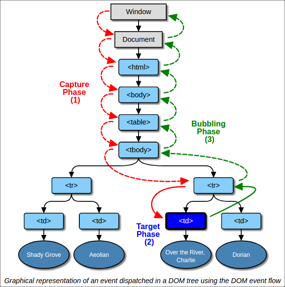

# 📗  Events








"이벤트"란, 웹 상에서 발생하는 사건들을 통칭하는 단어입니다. 예를 들면, 사용자가 화면의 일부를 "클릭"하거나 마우스를 이용해 드래그하거나 윈도우의 사이즈를 줄이거나 하는 행위 등 입니다. 이벤트의 종류는 굉장히 많습니다. 여러분이 상상할 수 있는 대부분의 브라우저 관련 "이벤트"들은 우리가 자바스크립트로 감지할 수 있습니다.

* [이벤트 목록](https://developer.mozilla.org/ko/docs/Web/Events)

절대 위 목록을 암기하려 하지 마세요. 필요한 상황이 온다면 조사하고 적용하면 됩니다.

#### 이벤트 발생을 감지하는 방법

우리는 자바스크립트를 이용하여 DOM 요소를 기준으로 이벤트를 감지하고 우리가 원하는 작업을 수행할 수 있습니다.

예를 들어, 어떤 버튼이 클릭되었을때 경고창을 보여주도록 해보겠습니다.

```markup
<div>
  <p>아래 버튼을 누르시면 경고창이 날아갑니다!</p>
  <button>!경고!</button>
</div>
```

```javascript
const button = document.querySelector("button");

button.addEventListener("click", function onButtonClick () {
  alert("경고합니다!");
});
```

위 예제 코드에서는 `addEventListener`라는 메소드를 이용했습니다. 모든 DOM 요소는 `addEventListener`를 사용할 수 있습니다.

자세히 예제를 보시면, `addEventListener` 메소드는 두 가지 인자를 받았습니다.

1. `"click"` 문자열 ([목록에 나열된 이벤트명](https://developer.mozilla.org/ko/docs/Web/Events) 중 하나)
2. `onButtonClick` 함수 (우리가 원하는 실행 내용을 담은 함수)

`addEventListener`는 첫번째 인자로 받은 이벤트가 발생하면(발생한 직후에), 두번째 인자로 받은 함수를 실행합니다.

```markup
<div>
  <p>아래 버튼을 누르시면 경고창이 날아갑니다!</p>
  <button>경고 1</button>
  <button>경고 2</button>
</div>
```

```javascript
const button = document.querySelector("button");

button.addEventListener("click", function onButtonClick () {
  alert("경고합니다!");
});
```

위 예제 코드에서는 첫 번째 버튼("경고 1")에 대해서만 클릭 이벤트가 등록되고, 두 번째 버튼은 클릭 이벤트에 대한 처리가 되지 않습니다. **이벤트 등록은 DOM 요소 단위로 이루어지고,** 현재 우리는 첫 번째 버튼에 "클릭" 이벤트를 등록해놓았기 때문입니다. 만약 두 가지 버튼 모두 클릭에 대한 처리를 하고 싶었다면 아래와 같이 해야 합니다.

```markup
<div>
  <p>아래 버튼을 누르시면 경고창이 날아갑니다!</p>
  <button>경고 1</button>
  <button>경고 2</button>
</div>
```

```javascript
const button1 = document.querySelectorAll("button")[0];
const button2 = document.querySelectorAll("button")[1];

button1.addEventListener("click", function onButtonClick () {
  alert("경고합니다! 버튼 1!");
});

button2.addEventListener("click", function onButtonClick () {
  alert("경고합니다! 버튼 2!");
});
```

**⛔️ 중복되는 코드.. 싫어하시죠?** 위의 예제 코드에서 중복되는 부분을 어떻게 하면 조금 줄여볼 수 있을까요? **프로그래밍에 정답은 없습니다만, 한 가지 방법을 보여드리겠습니다.**

```markup
<div>
  <p>아래 버튼을 누르시면 경고창이 날아갑니다!</p>
  <button>경고 1</button>
  <button>경고 2</button>
</div>
```

```javascript
const div = document.querySelector("div");

div.addEventListener("click", function onClick () {
  alert("경고합니다!");
});
```

위 예제 코드는 전체 요소들을 감싸고 있는 `div` 요소에게 이벤트를 등록해놓았습니다. 그렇기에, `div` 요소의 하위에 존재하는 요소들을 클릭해도 `onClick` 함수가 실행됩니다. **하지만 이제는 버튼 1과 버튼 2를 구분할 수 없게 되었습니다.** 이 문제는 또 어떻게 해결할 수 있을까요?

우리가 이벤트를 등록할때 전달하는 두 번째 인자, 예를 들어 위의 예제 코드에서 `onClick` 함수는 일반적으로 Event Handler라고 부릅니다. Event Handler에는 한 가지 인자가 들어오는데, 우리가 원한다면 매개 변수를 선언하여 사용할 수 있습니다.

```markup
<div>
  <p>아래 버튼을 누르시면 경고창이 날아갑니다!</p>
  <button>경고 1</button>
  <button>경고 2</button>
</div>
```

```javascript
const div = document.querySelector("div");

// Event Handler의 매개 변수는 보통 ev 혹은 event라고 이름 짓습니다.
div.addEventListener("click", function onClick (ev) {
  alert("경고합니다!");
});
```

위 예제 코드에서 `ev`라고 이름 지어놓은 매개 변수는 우리가 보통 "이벤트 객체"라고 부릅니다. **이벤트 객체는 현재 발생한 이벤트에 대한 상세 정보를 담고 있습니다.**

```markup
<div>
  <p>아래 버튼을 누르시면 경고창이 날아갑니다!</p>
  <button>경고 1</button>
  <button>경고 2</button>
</div>
```

```javascript
const div = document.querySelector("div");

// 이벤트 객체의 `target` 속성은 현재 이벤트가 발생한 요소를 가리킵니다. 예) button 요소
div.addEventListener("click", function onClick (ev) {
  alert("경고합니다! " + ev.target.textContent);
});
```

**위에 적혀있듯, `.target`이라는 속성은 이벤트가 발생한 요소를 가리킵니다. 여기서 말하는 요소란, 앞 단계에서 우리가 계속 다뤄왔던 Node/Element를 뜻합니다.**

* 만약 사용자가 "경고 1"을 클릭한다면, `ev.target`은 첫 번째 버튼 요소가 됩니다.
* 만약 사용자가 "경고 2"을 클릭한다면, `ev.target`은 두 번째 버튼 요소가 됩니다.
* 만약 사용자가 "아래 버튼을 누르시면 경고창이 날아갑니다!"을 클릭한다면, `ev.target`은 `p` 요소가 됩니다.

하지만 현재 우리는 버튼을 클릭했을때에만 경고창을 띄우고 싶습니다.

```markup
<div>
  <p>아래 버튼을 누르시면 경고창이 날아갑니다!</p>
  <button>경고 1</button>
  <button>경고 2</button>
</div>
```

```javascript
const div = document.querySelector("div");

div.addEventListener("click", function onClick (ev) {
  if (ev.target.tagName === "P") {
    return;
  }

  alert("경고합니다! " + ev.target.textContent);
});
```

현재 주어진 상황에서는 위와 같이 태그 이름으로 우리는 원하는 요소를 구분할 수 있고, 이를 이용하여 성공적으로 작업을 마칠 수 있습니다. 👏🏻

> 시간이 되신다면, Event 객체 속성 중 방금 우리가 사용한 target 속성과 currentTarget 속성의 차이점에 대해 조사해보세요.

### Event Delegation






